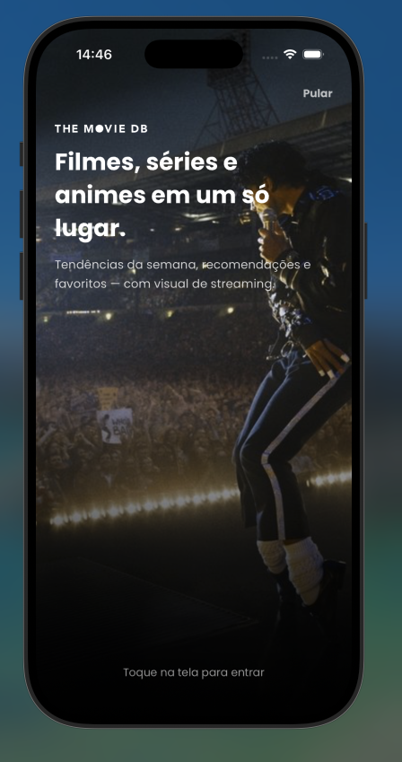
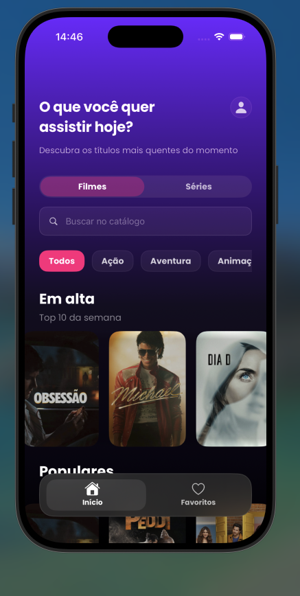
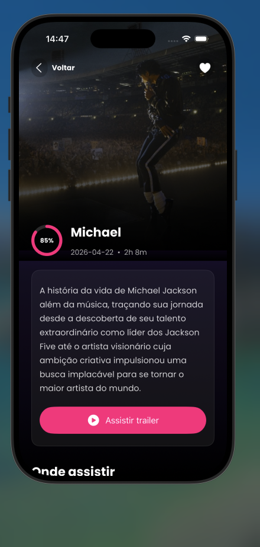
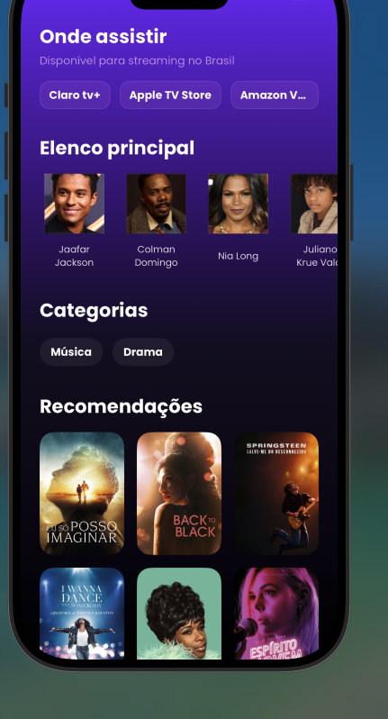
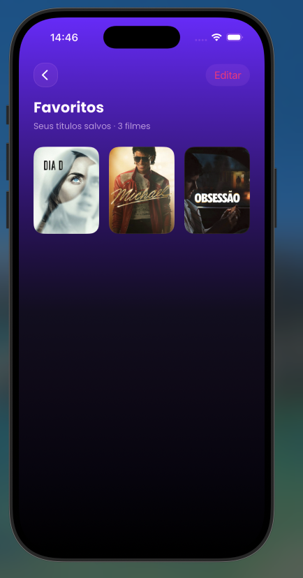

# TMDB Movie

App iOS de portfólio para explorar **filmes e séries** com a [API TMDB v3](https://developer.themoviedb.org/docs). O foco é demonstrar engenharia iOS sólida: **UIKit + ViewCode**, arquitetura **MVVM-C**, integração REST, concorrência moderna, design system e testes unitários — sem depender de Storyboards na UI principal.


---

## Visão geral

| | |
|---|---|
| **Plataforma** | iOS (UIKit) |
| **Arquitetura** | MVVM-C |
| **UI** | 100% programática (ViewCode) |
| **Rede** | `URLSession` + `async/await` |
| **Persistência** | Favoritos em `UserDefaults` |
| **Testes** | 35 testes unitários (XCTest) |

### Objetivo

Construir um app de catálogo cinematográfico com experiência premium, código organizado por features e decisões explícitas de arquitetura — adequado para **GitHub**, **LinkedIn** e **entrevistas técnicas**.

### Principais features

- **Splash** animada com slideshow de backdrops TMDB, motion parallax e estados de loading/erro/retry
- **Home** com abas Filmes e Séries, busca paginada, filtros por gênero e carrosséis (trending, popular)
- **Detalhe** de filme/série: sinopse, rating, trailer (YouTube), elenco, categorias, onde assistir (BR) e recomendações
- **Favoritos** locais com suporte a `movie` e `tv` (mesmo ID, kinds distintos)
- **Feedback unificado** para loading, vazio e erro em Home, Description e Favorites

---

## Screenshots

| Splash | Home |
|:------:|:----:|
|  |  |

| Detalhe (hero) | Detalhe (seções) | Favoritos |
|:--------------:|:----------------:|:---------:|
|  |  |  |

---

## Arquitetura

**UIKit + ViewCode + MVVM-C**

```
┌─────────────────────────────────────────────────────────┐
│  AppCoordinator (composition root + navegação)          │
├─────────────┬──────────────┬──────────────┬─────────────┤
│   Splash    │     Home     │ Description  │  Favorites  │
│ Coordinator │ Coordinator  │  (push/modal)│ Coordinator │
├─────────────┴──────────────┴──────────────┴─────────────┤
│  ViewController  →  View (ViewCode)  →  DesignSystem    │
├─────────────────────────────────────────────────────────┤
│  ViewModel (@MainActor, Task cancellation)              │
├─────────────────────────────────────────────────────────┤
│  TMDBService (protocol)  →  APIClient  →  TMDB REST API │
│  ImageLoader (actor)     →  CDN image.tmdb.org          │
│  FavoritesStore          →  UserDefaults                  │
└─────────────────────────────────────────────────────────┘
```

| Camada | Responsabilidade |
|--------|------------------|
| **App / Coordinator** | Composition root, fluxo Splash → Home → Description / Favorites |
| **Features** | Telas por domínio (`Splash`, `Home`, `Description`, `Favorites`) |
| **ViewModel** | Estado, transformação DTO → UI, favoritos, cancelamento de `Task` |
| **Services** | `TMDBService` — endpoints e agregações da API |
| **Networking** | `APIClient`, `Endpoint`, `APIError` |
| **DesignSystem** | Tokens (`DSColors`, `DSSpacing`, `DSFonts`) e componentes reutilizáveis |
| **Commons** | `ImageLoader`, `DSFeedbackView`, extensões de layout |

### Fluxo principal

```
Splash (tap to continue / skip)
    → Home (Filmes | Séries, busca paginada, gêneros, carrosséis)
        → Detalhe (sinopse, trailer, elenco, providers BR, recomendações)
        → Favoritos (lista local, edição, limpar)
```

Coordinators filhos são **retidos** em `childCoordinators` durante fluxos modais (ex.: Favoritos).

---

## Engineering Highlights

Pontos técnicos que valem destaque em revisão de código ou entrevista:

- **Coordinators** — navegação desacoplada das ViewControllers; `AppCoordinator` injeta dependências
- **ViewModels testáveis** — estado via closures (`onStateChange`); sem UIKit nos ViewModels
- **Serviços por protocolo** — `TMDBServiceProtocol`, `FavoritesStoreProtocol`, `ImageLoaderProtocol` facilitam mocks
- **`ImageLoader` como `actor`** — cache `NSCache`, deduplicação de requests em voo (`inFlight`)
- **`APIClient` desacoplado** — HTTP genérico + `Endpoint`; erros mapeados para mensagens de usuário
- **`DSFeedbackView` reutilizável** — loading, vazio e erro com retry; extensões por tela (`HomeViewController+Feedback`, `DescriptionViewController+Feedback`)
- **Design tokens** — `DSColors` semânticos (`textPrimary`, `surface`, `border`, `accentSecondary`, …) em vez de cores hardcoded
- **Testes com mocks** — `TMDBServiceMock`, `MockURLProtocol`; sem rede real nos testes
- **Separação de responsabilidades** — ViewControllers enxutas; views e componentes extraídos (ex.: `SplashContentView`, `HomeBottomTabBarView`, `DescriptionBackdropLoader`)

---

## Refactoring & Quality

O projeto passou por uma rodada consciente de **polish de engenharia** (sem novas features):

| Área | O que foi feito |
|------|-----------------|
| **Limpeza** | Remoção de código morto, targets duplicados e módulos não usados |
| **Organização** | Estrutura `App/`, `Features/`, `Services/`, `DesignSystem/`, `Networking/` |
| **ViewControllers** | Home **536 → 312** linhas; Splash **441 → 205**; Description **155 → 123** |
| **Componentes** | Extração de views (`SplashStatusView`, `SplashHeroBackgroundView`, `HomeCollapsingHeaderHandler`, …) |
| **ViewModels** | `DescriptionViewModel` unificou mapeamento Movie/TV via `DetailContent` privado |
| **Design System** | Migração de cores hardcoded para `DSColors` |
| **Testes** | **21 → 35** testes — ViewModels, paginação, HTTP, favoritos, edge cases de Description |
| **Secrets** | `Secrets.xcconfig` no `.gitignore`; exemplo versionado |

Princípio: **refatoração incremental**, comportamento visual preservado, build e testes verdes a cada etapa.

---

## Integração TMDB

- Base: `https://api.themoviedb.org/3`
- Imagens: `https://image.tmdb.org/t/p/{size}/{path}` via `AppConfig.tmdbImageURL`
- Autenticação: Bearer Token + API Key (via `xcconfig` → `Info.plist`)
- Destaques de API:
  - Catálogo **Filmes** e **Séries** na Home
  - Busca paginada (`page`, `total_pages`, `total_results`)
  - Detalhe agregado com `append_to_response` (créditos, vídeos, recomendações)
  - `watch/providers` região **BR** em paralelo ao detalhe
  - Trending, popular, discover por gênero

---

## Favoritos locais

- `FavoritesStore` persiste em `UserDefaults`
- Chave composta por **`id` + `MediaKind`** — filme e série com mesmo ID numérico são entradas distintas
- Compatibilidade com dados legados (decode sem `mediaKind` assume `.movie`)
- Toggle de favorito na Description atualiza store e re-emite estado carregado

---

## Design System

| Token / componente | Uso |
|------------------|-----|
| `DSColors` | Cores semânticas (texto, superfície, borda, accent, overlay) |
| `DSSpacing` | Grid de 8pt |
| `DSFonts` | Poppins (Regular, Medium, Bold) |
| `GradientBackgroundView` | Fundo roxo → preto nas telas principais |
| `DSFeedbackView` | Estados de loading, vazio e erro |
| `CustomButton`, `SearchBarView`, chips, carrosséis | Componentes de UI reutilizáveis |

---

## Concorrência

- **`async/await`** em `TMDBService`, `APIClient` e `ImageLoader`
- **`Task` cancellation** — `viewModel.cancel()` em `viewWillDisappear` nas telas com load assíncrono
- **`@MainActor`** nos ViewModels e updates de UI
- Requests paralelos no detalhe: `async let detail` + `async let providers`
- Debounce de busca na Home com `DispatchWorkItem`

---

## Cache e imagens

`ImageLoader` (`actor`):

- Cache em memória (`NSCache`) com limites de contagem e custo
- Coalescing de requests duplicados para a mesma URL
- Usado em posters, backdrops, elenco e slideshow da Splash

---

## Loading, vazio e erro

| Tela | Comportamento |
|------|---------------|
| **Splash** | Loading, erro com retry, tap-to-continue quando carregado |
| **Home** | `DSFeedbackView` para busca vazia, erro de rede e reload |
| **Description** | Overlay de loading/erro; conteúdo com alpha reduzido durante load |
| **Favoritos** | Estado vazio com CTA para explorar |

Erros HTTP mapeados em `APIError.userMessage` (401, 404, 429, genérico).

---

## Testes

**35 testes unitários** — sem dependência de rede real.

| Arquivo | Cobertura |
|---------|-----------|
| `DescriptionViewModelTests` | Movie/TV, favoritos, providers, runtime, overview, recomendações, trailer |
| `HomeViewModelTests` | Load inicial, erro de busca |
| `HomePaginationTests` | Paginação, load more, estado vazio |
| `FavoritesStoreTests` | Add/remove, duplicatas, `MediaKind`, decode legado |
| `APIClientHTTPTests` | Mapeamento 401/404/429 via `MockURLProtocol` |
| `APIErrorUserMessageTests` | Mensagens de erro para UI |
| `TMDBServiceTests` | Construção de endpoints |

### Como rodar os testes

**Xcode:** `Cmd + U` no scheme **TMDB Movie**.

**Terminal** (recomendado — evita conflito com DerivedData global):

```bash
xcodebuild -scheme "TMDB Movie" \
  -destination "platform=iOS Simulator,name=iPhone 17,OS=latest" \
  -derivedDataPath ".derivedData" \
  test
```

> Ajuste `name` e `OS` conforme simuladores instalados (`xcrun simctl list devices available`).

---

## Configuração

### Requisitos

- **Xcode 16+** (projeto testado com Xcode recente e simulador iOS 18+)
- Conta gratuita no [TMDB](https://www.themoviedb.org/) (API Key + Bearer Token)

### Secrets.xcconfig

1. Copie o exemplo:

   ```bash
   cp "TMDB Movie/Secrets.xcconfig.example" "TMDB Movie/Secrets.xcconfig"
   ```

2. Edite `TMDB Movie/Secrets.xcconfig`:

   ```
   TMDB_BEARER_TOKEN = seu_bearer_token
   TMDB_API_KEY = sua_api_key
   ```

3. Obtenha as chaves em: https://www.themoviedb.org/settings/api

> **Nunca commite** `Secrets.xcconfig` — ele está no `.gitignore`.

### Como rodar o projeto

```bash
git clone https://github.com/ArthurFerreira04/TMDBMovie.git
cd TMDBMovie
cp "TMDB Movie/Secrets.xcconfig.example" "TMDB Movie/Secrets.xcconfig"
# preencha as chaves
open "TMDB Movie.xcodeproj"
```

No Xcode: scheme **TMDB Movie** → `Cmd + R`.

**Build via terminal:**

```bash
xcodebuild -scheme "TMDB Movie" \
  -destination "generic/platform=iOS Simulator" \
  -derivedDataPath ".derivedData" \
  build
```

---

## Estrutura de pastas

```
TMDB Movie/
├── App/                          # AppDelegate, SceneDelegate, Coordinators
├── Core/                         # AppConfig, URLs TMDB
├── Networking/                   # APIClient, Endpoint, APIError
├── Services/                     # TMDBService, DTOs
├── DesignSystem/                 # DSColors, DSFonts, componentes
├── Commons/                      # ImageLoader, DSFeedbackView, ViewCodeType
├── Model/                        # PosterItem, MediaKind, CastItem, …
├── Features/
│   ├── Splash/                   # SplashViewController, Views/, MotionEffects
│   ├── Home/                     # HomeViewController, cells, header, tab bar
│   ├── Description/              # ViewModel, View, sections, BackdropLoader
│   └── Favorites/                # Store, ViewModel, Coordinator
├── Assets.xcassets
├── Info.plist
└── Secrets.xcconfig.example

TMDB MovieTests/
├── Mocks/                        # TMDBServiceMock, MockURLProtocol
└── *Tests.swift
```

---

## Decisões técnicas

- **MVVM-C** em vez de VIPER/Clean completo — equilíbrio entre clareza e tamanho de portfólio
- **ViewCode** — layout explícito, sem Storyboards nas features principais
- **Coordinators retidos** — evita desalocação prematura em fluxos modais
- **`append_to_response`** no detalhe — menos round-trips à API
- **Providers BR em paralelo** — `async let` no `DescriptionViewModel`
- **Busca paginada** — `loadMoreSearchIfNeeded` com metadados `total_pages`
- **Secrets via xcconfig** — chaves fora do código e fora do Git
- **Smoke tests removidos** do target de produção — cobertura via unit tests
- **Protocols nos serviços** — testabilidade sem frameworks de DI pesados

---

## CI (GitHub Actions)

Workflow em [`.github/workflows/ios.yml`](.github/workflows/ios.yml):

- **Build** no simulador genérico com `Secrets.xcconfig` gerado a partir do exemplo
- **Testes** documentados para execução local — o target de testes usa deployment target recente e simulador específico; rodar CI completo exigiria pin de versão do Xcode no runner

Badge (após push para `main`):

```markdown

```

---

## Próximos passos possíveis

- [x] Screenshots da Splash, Home, Detalhe e Favoritos no README
- [ ] Pin de Xcode no CI para rodar os 35 testes no GitHub Actions
- [ ] Testes de snapshot UI (opcional)
- [ ] Localização (pt-BR / en)
- [ ] SwiftLint / SwiftFormat
- [ ] Módulo de persistência (Core Data / SwiftData) se escopo crescer
- [ ] Deep link para detalhe a partir de notificação ou widget

---

## Checklist antes de publicar

- [ ] `Secrets.xcconfig` **não** está no commit
- [ ] `Secrets.xcconfig.example` está no repositório
- [x] Screenshots adicionadas em `docs/screenshots/`
- [ ] Build OK no Xcode
- [ ] 35/35 testes passando (`Cmd + U`)
- [ ] App abre Splash → Home com dados reais da API
- [x] README com URL do repositório e badge de CI atualizados

---

## Licença e créditos

Projeto de estudo e portfólio.

Dados e imagens via [The Movie Database (TMDB)](https://www.themoviedb.org/). Este produto usa a API TMDB mas **não é endossado ou certificado** pelo TMDB.

## Autor

**Arthur Ferreira** — demonstração de skills iOS para portfólio e entrevistas técnicas.
